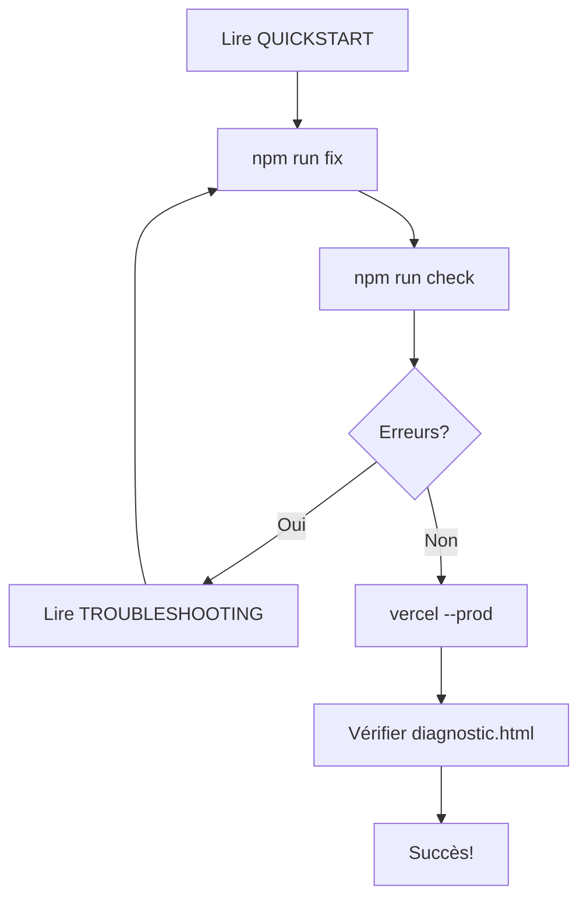

# 📚 INDEX DE DOCUMENTATION

Bienvenue dans votre guide complet pour déployer votre site WordPress statique sur Vercel!

---

## 🚀 Commencer Rapidement

### Pour les Impatients (5 minutes)
👉 **Lire**: [`QUICKSTART.md`](QUICKSTART.md)

```bash
./deploy.sh --prod
```

### Pour une Vue Complète
👉 **Lire**: [`README.md`](README.md)

---

## 📋 Documentation Complète

### 🎯 Par Sujet

| Document | Contenu | Temps |
|----------|---------|-------|
| **[QUICKSTART.md](QUICKSTART.md)** | Guide 5 minutes, commandes essentielles | 5 min |
| **[README.md](README.md)** | Vue d'ensemble, structure, prérequis | 10 min |
| **[DEPLOYMENT.md](DEPLOYMENT.md)** | Guide complet étape par étape | 20 min |
| **[CHECKLIST.md](CHECKLIST.md)** | Vérifications préalables et post-déploiement | 10 min |
| **[FIXES.md](FIXES.md)** | Résumé des réparations appliquées | 5 min |
| **[TROUBLESHOOTING.md](TROUBLESHOOTING.md)** | Solutions aux problèmes courants | 30 min |
| **[SCENARIOS.md](SCENARIOS.md)** | Solutions par cas d'usage | 20 min |

### 🔍 Outils Interactifs

| Outil | Utilité |
|-------|---------|
| **[diagnostic.html](diagnostic.html)** | Scanner des ressources + état du site |
| **[check-resources.js](check-resources.js)** | Vérification des fichiers |
| **[fix-urls.js](fix-urls.js)** | Correction automatique des URLs |

### ⚙️ Configuration

| Fichier | Utilité |
|---------|---------|
| **[vercel.json](vercel.json)** | Configuration Vercel (caching, headers) |
| **[package.json](package.json)** | Scripts npm (build, check, fix) |
| **[.htaccess](.htaccess)** | Configuration Apache |
| **[.gitignore](.gitignore)** | Exclusions Git |
| **[.vercelignore](.vercelignore)** | Exclusions Vercel |

### 🚀 Déploiement

| Script | Utilité | OS |
|--------|---------|-----|
| **[deploy.sh](deploy.sh)** | Déploiement automatisé | macOS/Linux |
| **[deploy.bat](deploy.bat)** | Déploiement automatisé | Windows |

---

## 🎯 Guide par Profil

### 👨‍💼 Je suis pressé (5 minutes)
1. Lire: [`QUICKSTART.md`](QUICKSTART.md)
2. Exécuter: `./deploy.sh --prod`
3. Vérifier: Accéder à l'URL donnée

### 👨‍💻 Je suis développeur (15 minutes)
1. Lire: [`DEPLOYMENT.md`](DEPLOYMENT.md) section "Configuration"
2. Exécuter: 
   ```bash
   npm run check
   npm run fix
   vercel --prod
   ```
3. Vérifier: `/diagnostic.html`

### 🔧 J'ai un problème (30 minutes)
1. Lire: [`TROUBLESHOOTING.md`](TROUBLESHOOTING.md)
2. Trouver la section correspondant à votre problème
3. Suivre les solutions proposées
4. Utiliser: `/diagnostic.html` pour confirmer

### 📚 Je veux comprendre (1 heure)
1. Lire: [`README.md`](README.md)
2. Lire: [`DEPLOYMENT.md`](DEPLOYMENT.md)
3. Lire: [`CHECKLIST.md`](CHECKLIST.md)
4. Explorer: [`SCENARIOS.md`](SCENARIOS.md)

---

## 🚀 Processus de Déploiement



---

## 📞 Support Rapide

### Je cherche...

**Comment déployer rapidement?**
→ [`QUICKSTART.md`](QUICKSTART.md)

**Mes fichiers CSS ne chargent pas**
→ [`TROUBLESHOOTING.md`](TROUBLESHOOTING.md) → Section "CSS"

**Les images ne s'affichent pas**
→ [`TROUBLESHOOTING.md`](TROUBLESHOOTING.md) → Section "Images"

**Je veux vérifier l'intégrité du site**
→ Accéder à `/diagnostic.html`

**Je cherche les erreurs après déploiement**
→ F12 → Console → Ou `/diagnostic.html`

**Je veux modifier la configuration**
→ Éditer `vercel.json` et relire [`DEPLOYMENT.md`](DEPLOYMENT.md)

---

## 🎓 Apprentissage Progressif

### Niveau 1: Déploiement Simple
1. [`QUICKSTART.md`](QUICKSTART.md) - 5 min
2. Exécuter les commandes
3. ✅ Terminé

### Niveau 2: Déploiement Professionnel
1. [`README.md`](README.md) - 10 min
2. [`DEPLOYMENT.md`](DEPLOYMENT.md) - 20 min
3. [`CHECKLIST.md`](CHECKLIST.md) - 10 min
4. Suivre le processus complet
5. ✅ Terminé

### Niveau 3: Expert Troubleshooter
1. Tous les documents ci-dessus
2. [`TROUBLESHOOTING.md`](TROUBLESHOOTING.md) - 30 min
3. [`SCENARIOS.md`](SCENARIOS.md) - 20 min
4. Pouvoir résoudre n'importe quel problème
5. ✅ Expert

---

## 🔄 Workflow Standard

```bash
# 1. Préparer le code
npm run fix      # Corriger les URLs
npm run check    # Vérifier les ressources

# 2. Tester localement
npm start        # Lancer le serveur local
# Accéder à http://localhost:8000

# 3. Committer les changements
git add .
git commit -m "Description des changements"

# 4. Déployer
vercel --prod

# 5. Vérifier
# Accéder à l'URL Vercel
# Tester /diagnostic.html
```

---

## 📊 État du Projet

### ✅ Configuration
- [x] Vercel configuré
- [x] Git configuré
- [x] Scripts automatisés
- [x] Documentation complète

### ⚠️ À Vérifier
- [ ] Structures `wp-content/` et `wp-includes/` remplies
- [ ] Pas de fichiers CSS/JS manquants (voir `/diagnostic.html`)
- [ ] Pas d'erreurs 404 après déploiement

### 🎯 Prochaines Étapes
1. Exécuter `npm run check`
2. Exécuter `npm run fix` si nécessaire
3. Exécuter `./deploy.sh --prod` ou `vercel --prod`
4. Accéder à `/diagnostic.html` pour vérifier

---

## 🔗 Ressources Externes

| Ressource | Lien |
|-----------|------|
| Vercel Docs | https://vercel.com/docs |
| Static Generation | https://vercel.com/docs/frameworks/static-site-generation |
| WordPress Simply Static | https://wordpress.org/plugins/simply-static/ |
| GitHub | https://github.com |

---

## 💡 Conseils Essentiels

1. **Avant chaque déploiement**
   - Exécuter `npm run check`
   - Vérifier localement avec `npm start`

2. **En cas de problème**
   - Ouvrir F12 → Console pour voir les erreurs
   - Accéder à `/diagnostic.html`
   - Consulter [`TROUBLESHOOTING.md`](TROUBLESHOOTING.md)

3. **Performance**
   - Le caching est automatique (1 an)
   - GZIP est activé
   - CDN de Vercel accélère la diffusion

4. **Sécurité**
   - HTTPS automatique
   - Headers de sécurité configurés
   - Fichiers statiques uniquement (pas de PHP)

---

## 🎉 Prêt à Déployer?

```bash
# La commande la plus simple
./deploy.sh --prod

# Ou si vous préférez manuellement
npm run fix && npm run check && vercel --prod
```

**Ensuite:**
- Accéder à votre URL Vercel
- Ouvrir `/diagnostic.html`
- Profiter de votre site! 🚀

---

## 📝 Version et Date

- **Version**: 1.0.0
- **Créé**: 15 janvier 2026
- **Plateforme**: Vercel Static
- **Framework**: WordPress Simply Static

---

*Question fréquemment posée:*

**Q: Je n'ai pas Git installé**
A: Installer Git via https://git-scm.com, puis réessayer

**Q: Je n'ai pas Node.js**
A: Installer Node.js via https://nodejs.org, puis `npm install -g vercel`

**Q: Ça ne marche toujours pas?**
A: Accéder à `/diagnostic.html` et consulter les erreurs détaillées

---

**Bonne chance! 🚀**
